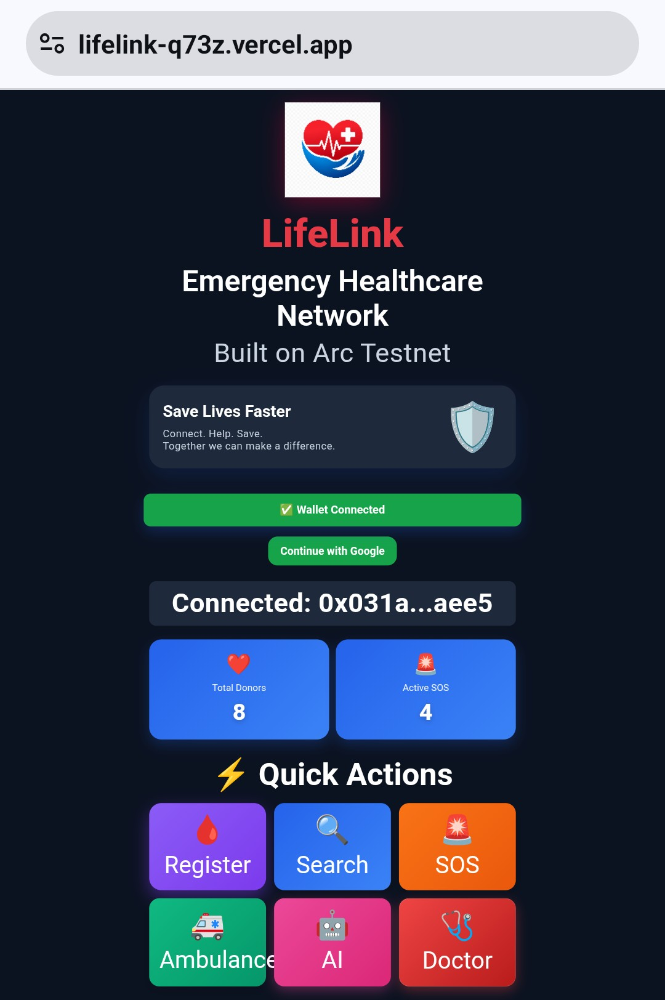

<div align="center">

# ❤️ LifeLink

### Decentralized Emergency Healthcare Network

**Built on Arc Testnet**

Connecting **Patients • Blood Donors • Doctors • Hospitals • Emergency Responders** through blockchain technology.

🌐 **Live Demo**  
https://lifelink-q73z.vercel.app

💻 **GitHub Repository**  
https://github.com/khanindradeka1993/lifelink


</div>

---

## ❤️ About LifeLink

LifeLink is a decentralized emergency healthcare network built on **Arc Testnet**. It combines blockchain technology, AI-powered assistance, digital health records, emergency coordination, and USDC payments into one platform.

LifeLink enables patients, blood donors, doctors, hospitals, and emergency responders to interact through transparent smart contracts, helping improve emergency response and healthcare accessibility.

---

# 🌍 The Problem

Healthcare emergencies require immediate action, yet traditional healthcare systems often face delays due to fragmented information and disconnected services.

Common challenges include:

- 🩸 Difficulty finding compatible blood donors quickly
- 🚑 Delayed emergency response coordination
- 🏥 Limited access to patient health records
- 💳 Slow and fragmented healthcare payment systems
- 📄 Medical records stored across multiple platforms
- 🔍 Limited transparency during emergency situations

---

# 💡 Our Solution

LifeLink connects patients, blood donors, doctors, hospitals, and emergency responders through blockchain technology on **Arc Testnet**.

It provides:

- 🩸 Blood donor registration and search
- 🚨 Blockchain-powered SOS emergency requests
- 🚑 Emergency ambulance requests
- 🤖 AI emergency first-aid assistance
- 👨‍⚕️ Doctor portal and patient records
- 🩺 Health profiles
- 💳 USDC hospital bill payments
- 🗺️ Nearby donor map
- 📊 Healthcare analytics

---

# ✨ Key Features

| Feature | Description |
|---------|-------------|
| 🩸 Blood Donor Registration | Register as a blood donor on-chain. |
| 🔍 Donor Search | Find donors by blood group and city. |
| 🗺️ Nearby Donor Map | View registered donor locations. |
| 🚨 SOS Emergency Request | Create urgent blood requests on-chain. |
| 🚑 Emergency Ambulance | Request emergency ambulance services on-chain. |
| 🩺 Health Profile | Store and manage health information through the healthcare workflow. |
| 👨‍⚕️ Doctor Portal | Retrieve available patient records using wallet addresses. |
| 🤖 AI Emergency Assistant | Receive AI-powered first-aid guidance. |
| 💳 Hospital Bill Payment | Pay hospital bills using USDC on Arc Testnet. |
| 📊 Analytics Dashboard | Monitor donors and emergency activity. |

---

# 🧪 Demo Testing Guide

> ⚠️ **Important:** LifeLink is a testnet demonstration. Use test accounts and testnet assets only. Do not enter real medical or financial information.

## 1. Open the Application

🌐 **Live Demo:**  
https://lifelink-q73z.vercel.app

Open LifeLink in a supported mobile or desktop browser.

## 2. Connect a Wallet

### 🦊 MetaMask

1. Select **Connect MetaMask**.
2. Approve the connection.
3. Switch to **Arc Testnet**.
4. Approve blockchain transactions when prompted.

### 🔵 Circle User-Controlled Wallet

1. Select the Circle Wallet / Google login option.
2. Sign in with Google.
3. Complete Circle wallet setup if required.
4. Approve wallet actions.
5. Continue to the dashboard.

Circle contract transactions are executed through the Circle Wallet SDK and LifeLink backend.

---

# 🩸 3. Test Blood Donor Registration

1. Connect a wallet.
2. Open **Blood Donor Registration**.
3. Enter name, blood group, city, phone and location.
4. Submit the registration.
5. Approve the transaction.
6. Wait for confirmation.
7. Reload the donor section.

**Expected result:** The donor appears in the blockchain-backed donor list.

---

# 🔍 4. Test Donor Search & Map

1. Open **Search Donors**.
2. Select the required blood group.
3. Select or enter the city.
4. Search.
5. Open the nearby donor map if needed.

**Expected result:** Matching donor data is loaded from the blockchain.

---

# 🚨 5. Test SOS Blood Request

1. Open **SOS Emergency**.
2. Enter patient name, blood group, hospital, city and contact.
3. Submit the request.
4. Approve the transaction.
5. Wait for confirmation.

**Expected result:** A new emergency blood request appears in the SOS section.

---

# 🩸 6. Test Donor Response

If the testing wallet has an eligible registered donor record:

1. Open an active SOS request.
2. Select **I'm Coming to Donate**.
3. Approve the transaction.
4. Wait for confirmation.

**Expected result:** The request becomes fulfilled on-chain.

> **Important:** The current donor contract associates a donor with the wallet address used during donor registration. The responding wallet therefore needs to satisfy the contract's donor authorization rules.

---

# 🚑 7. Test Emergency Ambulance

1. Open **Emergency Ambulance**.
2. Enter the required information.
3. Submit.
4. Approve the transaction.
5. Wait for confirmation.

**Expected result:** The ambulance request is stored on-chain and the application refreshes the emergency data.

---

# 🩺 8. Test Health Profile

1. Open **Health Profile**.
2. Enter the available health information.
3. Save the profile.
4. Approve the transaction if requested.
5. Wait for confirmation.

**Expected result:** The health profile is saved through the LifeLink healthcare workflow.

---

# 👨‍⚕️ 9. Test Doctor Portal

1. Open **Doctor Portal**.
2. Enter the patient's wallet address.
3. Search.
4. Review the available health information.

**Expected result:** Available patient information is retrieved from the healthcare contract.

---

# 🤖 10. Test AI Emergency Assistant

1. Open **AI Emergency Assistant**.
2. Enter an emergency-related question.
3. Submit.
4. Wait for the response.

**Expected result:** The assistant provides concise first-aid guidance.

> ⚠️ This is a demonstration tool and does not replace professional medical care or emergency services.

---

# 💳 11. Test Hospital Bill Payment

1. Open **Hospital Bill Payment**.
2. Enter the required payment information.
3. Use testnet USDC where required.
4. Submit.
5. Approve the transaction.
6. Wait for confirmation.

**Expected result:** The payment is processed using USDC on Arc Testnet.

---

# 🔄 Blockchain Data Architecture

```text
                 LifeLink
                    │
          ┌─────────┴─────────┐
          │                   │
      MetaMask          Circle Wallet
          │                   │
          └─────────┬─────────┘
                    │
              Arc Testnet
                    │
              Smart Contracts
                    │
       ┌────────────┼────────────┐
       │            │            │
    Donors       Requests    Healthcare
       │            │            │
       └────────────┼────────────┘
                    │
                LifeLink UI
```

Both wallet modes interact with the same LifeLink smart contracts and blockchain-backed application data.

---

# 🔐 Circle Wallet & Transaction Architecture

```text
Google Login
     ↓
Circle User
     ↓
Circle Wallet
     ↓
Transaction Challenge
     ↓
User Authorization
     ↓
Circle
     ↓
Arc Testnet
     ↓
LifeLink Smart Contract
```

Circle API credentials are handled through the LifeLink backend rather than exposed in frontend code.

---

# 📸 Application Screenshots

### 🏠 Home Dashboard


### 🩸 Blood Donor Registration


### 🔍 Search Donors & Nearby Donor Map


### 🚨 SOS Emergency Request


### 🚑 Emergency Ambulance


### 🩺 Health Profile


### 👨‍⚕️ Doctor Portal


### 🤖 AI Emergency Assistant


### 💳 Hospital Bill Payment


---

# 🛠️ Tech Stack

| Category | Technology |
|----------|------------|
| Blockchain | Arc Testnet |
| Smart Contracts | Solidity |
| Wallets | MetaMask + Circle User-Controlled Wallet |
| Circle Integration | Circle W3S SDK |
| Frontend | HTML5, CSS3, JavaScript |
| Web3 Library | Ethers.js |
| Maps | Leaflet.js + OpenStreetMap |
| AI Assistant | OpenRouter AI API |
| Payments | USDC |
| Backend | Vercel Serverless Functions |
| Deployment | Vercel |
| Version Control | Git & GitHub |

---

# 📜 Smart Contracts

| Contract | Purpose |
|----------|---------|
| 🩸 Blood Donor Contract | Blood donor registration and emergency blood requests |
| 🩺 Healthcare Contract | On-chain patient health profiles |
| 🚑 Emergency Contract | Ambulance requests and emergency coordination |
| 💳 Payment Contract | USDC hospital bill payments |

---

# 📂 Project Structure

```text
LifeLink/
│── index.html
│── style.css
│── app.js
│── health-profile.js
│── README.md
│── api/
│   ├── emergency-ai.js
│   ├── circle-token.js
│   └── execute-circle-tx.js
│── screenshots/
```

---

# 🧪 Demo Testing Checklist

```text
☐ Open LifeLink
☐ Connect MetaMask or Circle Wallet
☐ Register a blood donor
☐ Search for the donor
☐ View donor on the map
☐ Create an SOS blood request
☐ Respond using an eligible donor wallet
☐ Create an ambulance request
☐ Create/save a Health Profile
☐ Test Doctor Portal
☐ Test AI Emergency Assistant
☐ Test hospital USDC payment
☐ Verify blockchain transaction results
```

---

# ⚠️ Testnet Notes

- LifeLink currently operates on **Arc Testnet**.
- Use test accounts and testnet assets only.
- Blockchain transactions may take time to confirm.
- Wallet addresses are blockchain identities.
- Do not use real medical information for testing.
- Do not use real funds.

---

# 🚀 Roadmap

- 🌐 Deploy LifeLink on Arc Mainnet when ready.
- 🔐 Improve persistent Circle User-Controlled Wallet account handling.
- 📱 Continue improving mobile experience and application performance.
- 🏥 Expand LifeLink adoption among hospitals, doctors, blood donors, and emergency responders.
- 🌍 Make decentralized emergency healthcare accessible to communities worldwide.

---

# 👨‍💻 Developer

**Khanindra Deka**

Passionate Web3 builder creating decentralized healthcare solutions on **Arc Testnet**.

- **GitHub:** https://github.com/khanindradeka1993
- **X (Twitter):** https://x.com/khanindradeka20

---

# 📄 License

This project is released under the **MIT License**.

---

# ❤️ Support the Project

If you find **LifeLink** useful, please ⭐ star this repository and share your feedback.

Together, we can build a faster, more transparent, and decentralized emergency healthcare network powered by blockchain.
