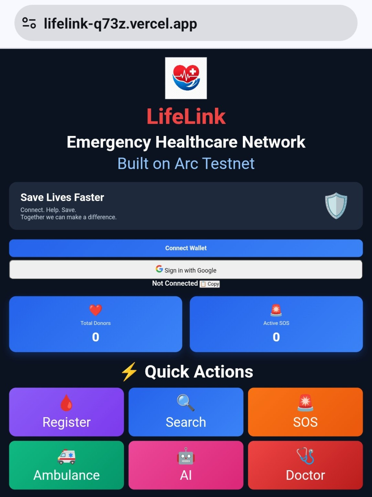
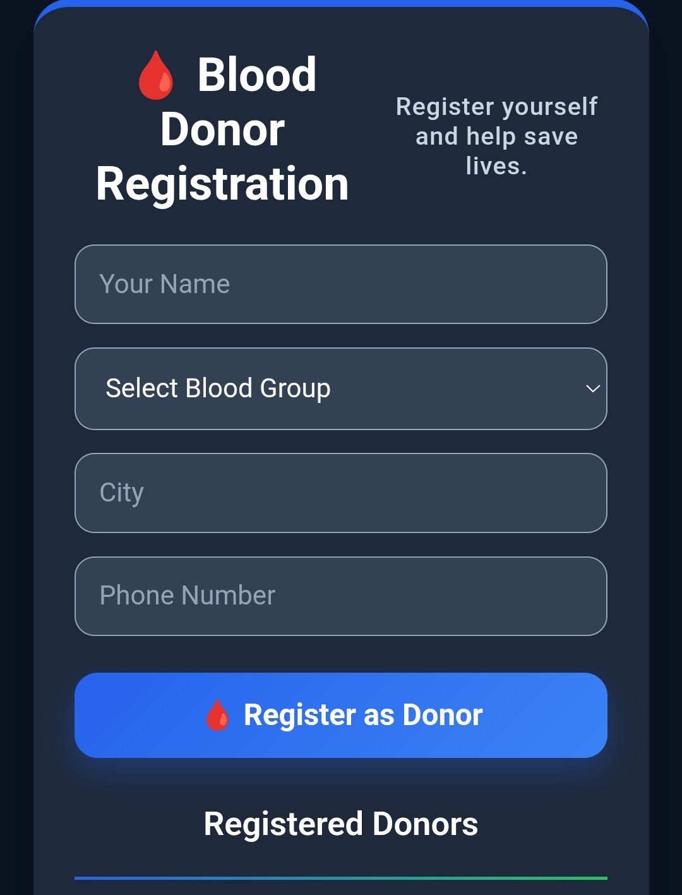
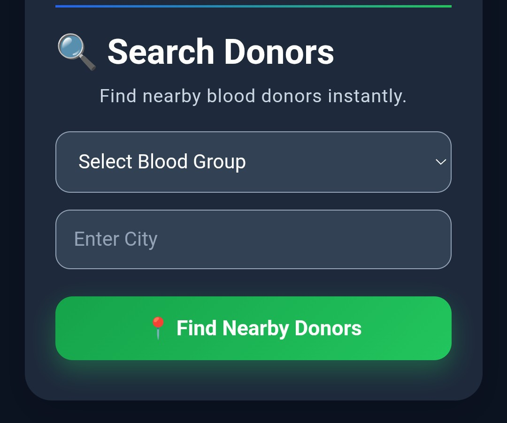
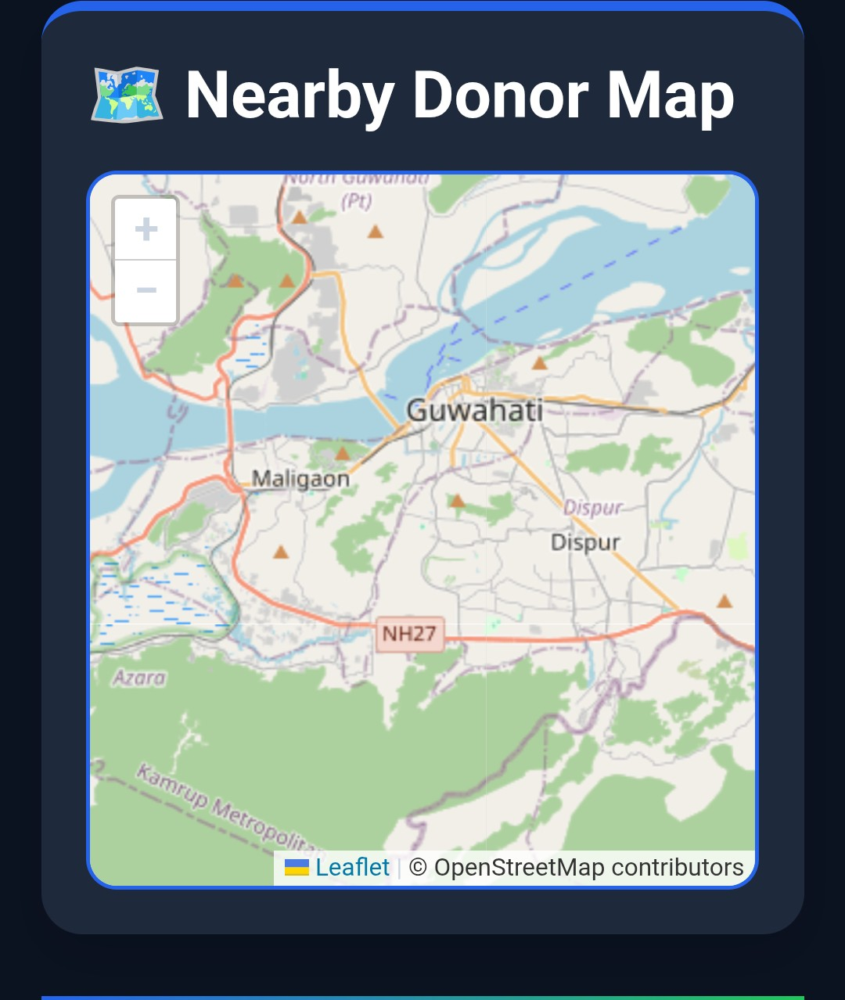
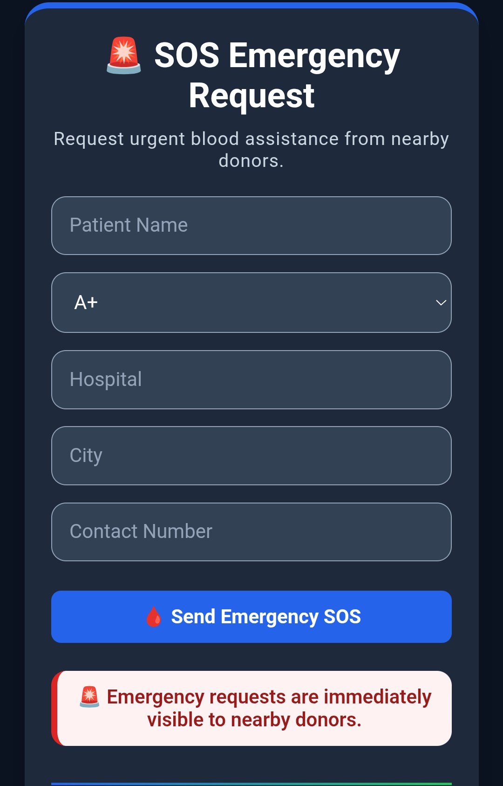
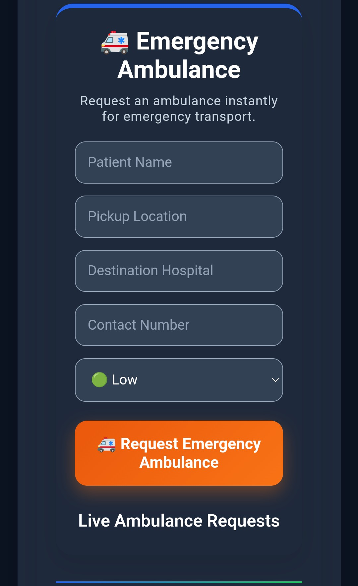
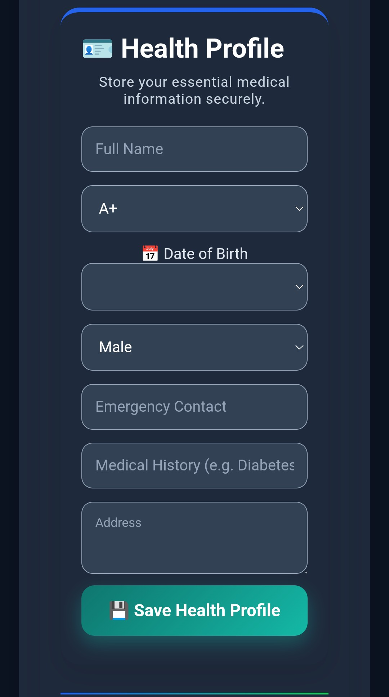
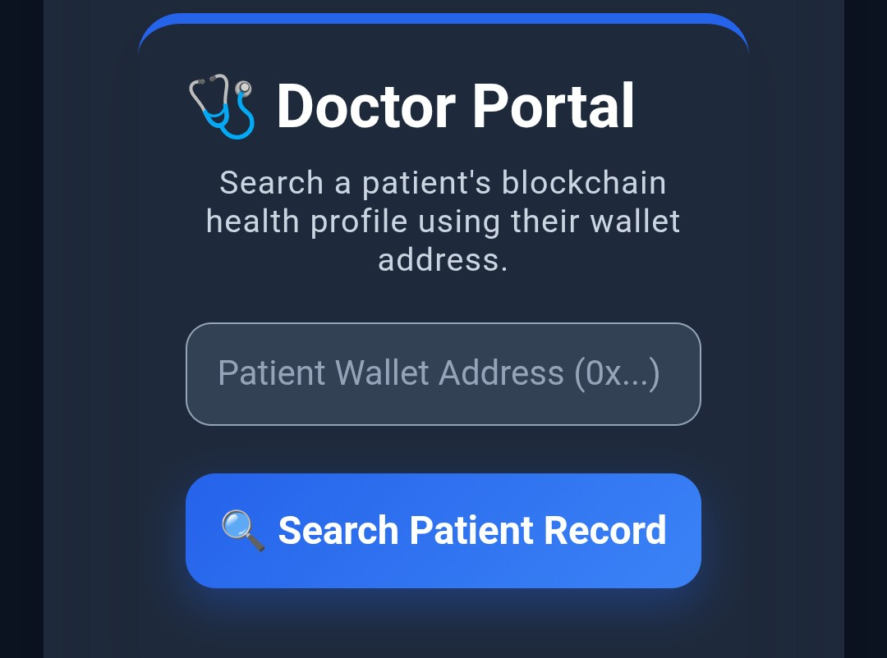
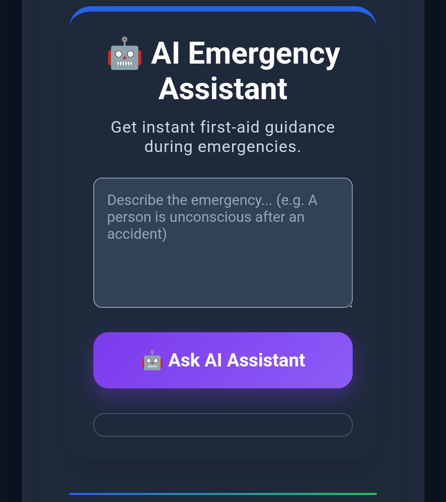
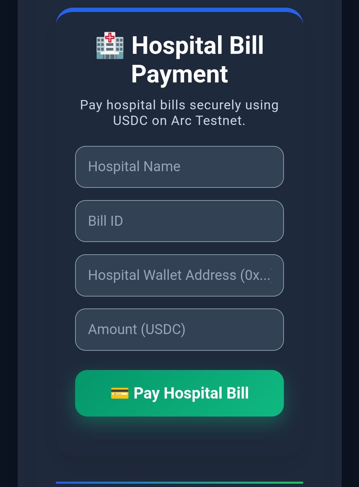

# ❤️ LifeLink

## Decentralized Emergency Healthcare Network

**Built on Arc Testnet**

Connecting **Patients • Blood Donors • Doctors • Hospitals • Emergency Responders** through blockchain technology.

🌐 **Live Demo:** https://lifelink-q73z.vercel.app

💻 **GitHub Repository:** https://github.com/khanindradeka1993/lifelink

---

## ❤️ About LifeLink

LifeLink is a decentralized emergency healthcare network built on **Arc Testnet**.

It combines blockchain technology, AI-powered assistance, digital health records, emergency coordination, and USDC payments into one platform.

LifeLink enables patients, blood donors, doctors, hospitals, and emergency responders to interact through blockchain-based healthcare services.

---

## ✨ Key Features

| Feature | Description |
|---|---|
| 🩸 Blood Donor Registration | Register as a blood donor on the blockchain. |
| 🔍 Donor Search | Find donors by blood group and city. |
| 🗺️ Nearby Donor Map | View registered donor locations. |
| 🚨 SOS Emergency Request | Create urgent blood requests on-chain. |
| 🚑 Emergency Ambulance | Request emergency ambulance services on-chain. |
| 🩺 Health Profile | Store and manage health information through the healthcare workflow. |
| 👨‍⚕️ Doctor Portal | Search available patient health records using wallet addresses. |
| 🤖 AI Emergency Assistant | Receive AI-powered first-aid guidance. |
| 💳 Hospital Bill Payment | Pay hospital bills using USDC on Arc Testnet. |
| 📊 Analytics Dashboard | Monitor donors and emergency activity. |

---

## 📱 Application Workflow

```text
Connect Wallet
       │
       ▼
Choose a Feature
       │
       ├── 🩸 Register as Blood Donor
       ├── 🔍 Search Nearby Donors
       ├── 🚨 Create SOS Emergency Request
       ├── 🚑 Request Emergency Ambulance
       ├── 🩺 Create Health Profile
       ├── 👨‍⚕️ Doctor Searches Patient Record
       ├── 🤖 Ask AI Emergency Assistant
       └── 💳 Pay Hospital Bill with USDC
```

---

# 🧪 Demo Testing Guide

> ⚠️ **Important:** LifeLink is currently an Arc Testnet demonstration. Use test accounts and testnet assets only. Do not enter real medical or financial information.

## 1. Open LifeLink

Open:

https://lifelink-q73z.vercel.app

---

## 2. Connect a Wallet

LifeLink supports:

- 🦊 MetaMask
- 🔵 Circle User-Controlled Wallet

### 🦊 MetaMask

1. Open LifeLink.
2. Select **Connect MetaMask**.
3. Approve the connection.
4. Switch to **Arc Testnet**.
5. Approve blockchain transactions when prompted.

### 🔵 Circle User-Controlled Wallet

1. Open LifeLink.
2. Select the Circle Wallet / Google login option.
3. Sign in with Google.
4. Complete Circle wallet setup if required.
5. Approve wallet actions.
6. Continue to the LifeLink dashboard.

---

## 3. 🩸 Test Blood Donor Registration

1. Connect your wallet.
2. Open **Blood Donor Registration**.
3. Enter name, blood group, city, phone number and location.
4. Select **Register as Donor**.
5. Approve the blockchain transaction.
6. Wait for confirmation.
7. Reload the donor section.

**Expected result:** The donor appears in the blockchain-backed donor list.

---

## 4. 🔍 Test Donor Search

1. Open **Search Donors**.
2. Select a blood group.
3. Enter/select a city.
4. Select **Find Nearby Donors**.

**Expected result:** Matching donors are retrieved from the blockchain and displayed.

The **Nearby Donor Map** can also show registered donor locations.

---

## 5. 🚨 Test SOS Emergency Request

1. Open **SOS Emergency Request**.
2. Enter patient name, blood group, hospital, city and contact number.
3. Select **Send Emergency SOS**.
4. Approve the transaction.
5. Wait for blockchain confirmation.

**Expected result:** The SOS request is recorded on-chain and becomes visible in the emergency request section.

---

## 6. 🩸 Test Donor Response

1. Register a donor using the testing wallet.
2. Create an SOS request.
3. Open the active request.
4. Select **I'm Coming to Donate**.
5. Approve the transaction.
6. Wait for confirmation.

**Expected result:** The request is processed according to the donor/request rules implemented by the smart contract.

> **Important:** The donor contract associates a donor with the wallet address used during donor registration.

---

## 7. 🚑 Test Emergency Ambulance

1. Open **Emergency Ambulance**.
2. Enter the emergency information.
3. Select **Request Emergency Ambulance**.
4. Approve the transaction.
5. Wait for confirmation.
6. Open the live ambulance request as an ambulance driver.
7. Select **Complete Request**.
8. Approve the transaction if required.
9. Wait for blockchain confirmation.

**Expected result:** The ambulance request is recorded on Arc Testnet, appears in the live ambulance requests, and can be successfully fulfilled by the ambulance driver. The request status should update to **fulfilled**.

---

## 8. 🩺 Test Health Profile

1. Open **Health Profile**.
2. Enter the available profile information.
3. Select **Save Health Profile**.
4. Approve the transaction if requested.
5. Wait for confirmation.

**Expected result:** The health profile is saved through the LifeLink healthcare workflow.

---

## 9. 👨‍⚕️ Test Doctor Portal

1. Open **Doctor Portal**.
2. Enter a patient's wallet address.
3. Select **Search Patient Record**.
4. Review the available patient information.

**Expected result:** The application queries the healthcare functionality and displays available patient information.

---

## 10. 🤖 Test AI Emergency Assistant

1. Open **AI Emergency Assistant**.
2. Describe the emergency.
3. Select **Ask AI Assistant**.
4. Wait for the response.

**Expected result:** The AI assistant provides concise first-aid guidance.

> ⚠️ The AI assistant is a demonstration/information tool and does not replace professional medical care or emergency services.

---

## 11. 💳 Test Hospital Bill Payment

1. Open the hospital payment section.
2. Enter the required payment information.
3. Use testnet USDC where required.
4. Submit the payment.
5. Approve the transaction.
6. Wait for confirmation.

**Expected result:** The payment is processed using USDC on Arc Testnet.

---

# 🔵 Circle Wallet Integration

LifeLink integrates **Circle User-Controlled Wallet infrastructure** through the Circle W3S SDK.

The Circle Wallet implementation is located at:

```text
src/
└── circle-wallet.js
```

The Circle Wallet module handles the application's Circle wallet integration and SDK interaction.

The architecture includes:

- 🔐 Google-based user authentication
- 👛 Circle User-Controlled Wallet
- 🔑 Wallet authorization
- 🧾 Transaction challenges
- ⛓️ Arc Testnet smart-contract transactions

### Circle Wallet Transaction Flow

```text
Google Login
      ↓
Circle User
      ↓
src/circle-wallet.js
      ↓
Circle W3S SDK
      ↓
Transaction Authorization
      ↓
LifeLink Backend
      ↓
Arc Testnet
      ↓
LifeLink Smart Contract
```

---

# 🔄 Blockchain Data Architecture

Both MetaMask and Circle Wallet interact with the same LifeLink blockchain infrastructure.

```text
                  LifeLink
                     │
           ┌─────────┴─────────┐
           │                   │
       MetaMask          Circle Wallet
           │                   │
           └─────────┬─────────┘
                     │
               Arc Testnet
                     │
             LifeLink Contracts
                     │
        ┌────────────┼────────────┐
        │            │            │
      Donors      Requests    Healthcare
        │            │            │
        └────────────┼────────────┘
                     │
                 LifeLink UI
```

The application reads blockchain-backed data from Arc Testnet while transactions are authorized through the connected wallet.

---

# 🔐 Circle Backend Architecture

Circle-related API operations that require backend handling are routed through Vercel serverless functions.

```text
LifeLink Frontend
       │
       ▼
Circle Wallet SDK
       │
       ▼
LifeLink API
       │
       ├── circle-token.js
       │
       └── execute-circle-tx.js
       │
       ▼
Circle API
       │
       ▼
Arc Testnet
```

This architecture keeps sensitive server-side credentials out of the frontend.

---


# 📸 Application Screenshots

> Below are screenshots showcasing the LifeLink application interface and core features.

### 🏠 Home Dashboard


### 🩸 Blood Donor Registration


### 🔍 Search Donors & Nearby Donor Map




### 🚨 SOS Emergency Request


### 🚑 Emergency Ambulance


### 🩺 Health Profile


### 👨‍⚕️ Doctor Portal


### 🤖 AI Emergency Assistant


### 💳 Hospital Bill Payment


---

# 🛠️ Tech Stack

| Category | Technology |
|---|---|
| Blockchain | Arc Testnet |
| Smart Contracts | Solidity |
| Wallets | MetaMask + Circle User-Controlled Wallet |
| Circle Integration | Circle W3S SDK |
| Frontend | HTML5, CSS3, JavaScript, Vite |
| Web3 Library | Ethers.js |
| Maps | Leaflet.js + OpenStreetMap |
| AI Assistant | OpenRouter AI API |
| Payments | USDC |
| Backend | Vercel Serverless Functions |
| Deployment | Vercel |
| Version Control | Git & GitHub |

---

## 📜 Smart Contracts

LifeLink uses smart-contract functionality deployed on **Arc Testnet**.

| Contract | Purpose | Contract Address |
|---|---|---|
| 🩸 Blood Donor Contract | Blood donor registration and emergency blood requests | `0x80C0E143602DfDaD980adF1ae3cfF9B9153Aa2b7` |
| 🩺 Healthcare Contract | Patient health profile functionality | `0xE32313e236784f57a7479a830E4a9c0ce22d0761` |
| 🚑 Emergency Contract | Emergency ambulance and coordination functionality | `0x8d1183f802b5688e5244a493Ea965e856150c2Ef` |
| 💳 Payment Contract | USDC hospital bill payments | `0x0CA164a6FE7FfEA47945761748D77cd0aa16Afb1` |

---

# 📂 Project Structure

```text
LifeLink/
│
├── index.html
├── style.css
├── app.js
├── health-profile.js
├── package.json
├── vite.config.js
├── README.md
│
├── src/
│   └── circle-wallet.js
│
├── api/
│   ├── emergency-ai.js
│   ├── circle-token.js
│   └── execute-circle-tx.js
│
└── screenshots/
```

---

# 🧪 Demo Testing Checklist

```text
☐ Open LifeLink
☐ Connect MetaMask or Circle Wallet
☐ Register a blood donor
☐ Search for the donor
☐ View the donor map
☐ Create an SOS blood request
☐ Test donor response
☐ Create an ambulance request
☐ View live ambulance requests
☐ Fulfill an ambulance request as an ambulance driver
☐ Verify the request is fulfilled
☐ Create/save a Health Profile
☐ Test Doctor Portal
☐ Test AI Emergency Assistant
☐ Test hospital USDC payment
☐ Verify blockchain transaction results
```

---

# ⚠️ Testnet Notes

- LifeLink currently operates on **Arc Testnet**.
- Use test accounts and testnet assets only.
- Blockchain transactions may take time to confirm.
- Wallet addresses are blockchain identities.
- Do not use real medical information for testing.
- Do not use real funds.
- Testnet behavior may change as the Arc ecosystem evolves.

---

# 🚀 Roadmap

- 🌐 Deploy LifeLink on Arc Mainnet when ready.
- 🔐 Improve persistent Circle User-Controlled Wallet account handling.
- 📱 Continue user experience improvement.
- 🏥 Expand LifeLink adoption among hospitals, doctors, blood donors, and emergency responders.
- 🌍 Make decentralized emergency healthcare accessible to communities worldwide.

---

# 👨‍💻 Developer

**Khanindra Deka**

Passionate Web3 builder creating decentralized healthcare solutions on **Arc Testnet**.

- GitHub: https://github.com/khanindradeka1993
- X: https://x.com/khanindradeka20

---

# 📄 License

This project is released under the **MIT License**.

---

# ❤️ Support the Project

If you find **LifeLink** useful, please ⭐ star this repository and share your feedback.

Together, we can build a faster, more transparent, and decentralized emergency healthcare network powered by blockchain.
